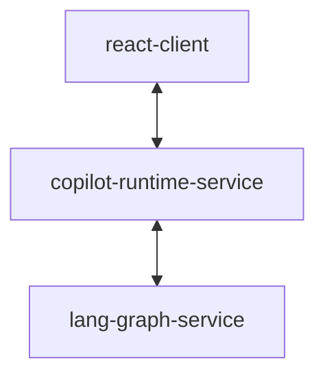

# Minimal Self-Hosted CopilotKit + LangGraph Agent

## Components



## Minimal Self-Hosted Configuration

* CopilitKit React without NextJS (Vite)
* Self Hosted CopilotKit Runtime with Node.js HTTP
* Self Hosted LangGraph Agent with FastAPI (LangGraph)

### CopilotKit UI
- [ ] NextJS
- [x] Vite

### CopilotKit Connection
- [ ] Copilot Cloud
- [x] Self-Hosted Copilot Runtime

### Self Hosted Copilot Runtime
- [ ] Next.js App Router
- [ ] Next.js Page Router
- [ ] Node.js Express
- [x] Node.js HTTP
- [ ] NestJS

### LangGraph Language
- [x] Python
- [ ] Typescript

### LangGraph Agent
- [ ] Local (LangGraph Studio)
- [x] Self hosted (FastAPI)
- [ ] LangGraph Platform

## Running

1. **Clone the repo:**
   ```sh
   git clone https://github.com/jrhicks/minimal-copilotkit-langgraph.git
   cd lang-graph-copilotkit
   ```

1. **Copy environment variables:**
   ```sh
   cp lang-graph-service/.env.example lang-graph-service/.env
   # Edit lang-graph-service/.env and set your OPENAI_API_KEY and LANGSMITH_API_KEY
   ```
2. **Install and start all services:**

   ```sh
   pnpm install
   ```

   ```sh
   pnpm run dev
   ```

- React client: http://localhost:5173
- Copilot runtime: http://localhost:4000/copilotkit
- LangGraph agent: http://localhost:8000/copilotkit

---

## Contributing

Contributions are welcome! Please open issues or pull requests for bug fixes, improvements, or new features.

---

## Environment Variables

- Copy `.env.example` to `.env` in `lang-graph-service`:
  ```sh
  cp lang-graph-service/.env.example lang-graph-service/.env
  ```
- Set your `OPENAI_API_KEY` and `LANGSMITH_API_KEY` in `lang-graph-service/.env`.

---

## License

MIT