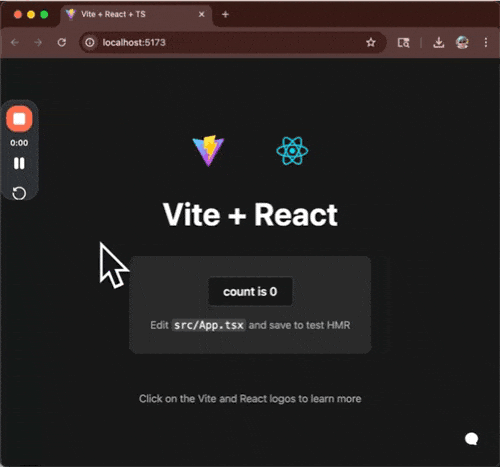
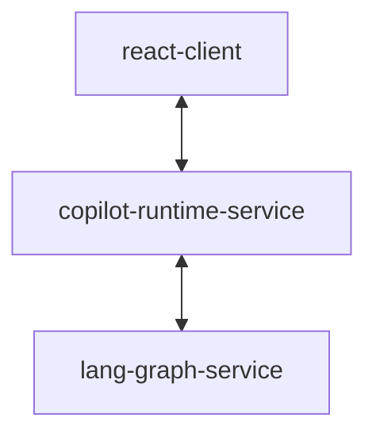

# 👋 Minimal CopilotKit + LangGraph Dojo

Get all AG-UI features betwen langgraph and copilotkit working with minimal cloud/framework dependencies.



## Minimal Cloud Dependencies

* CopilitKit React without NextJS (Vite)
* Self Hosted CopilotKit Runtime with Node.js HTTP
* Self Hosted LangGraph Agent with FastAPI (LangGraph)

### CopilotKit UI
- [ ] NextJS
- [x] Vite

### CopilotKit Connection
- [ ] Copilot Cloud
- [x] Self-Hosted Copilot Runtime

### Self Hosted Copilot Runtime
- [ ] Next.js App Router
- [ ] Next.js Page Router
- [ ] Node.js Express
- [x] Node.js HTTP
- [ ] NestJS

### LangGraph Language
- [x] Python
- [ ] Typescript

### LangGraph Agent
- [ ] Local (LangGraph Studio)
- [x] Self hosted (FastAPI)
- [ ] LangGraph Platform

## AG-UI Feature Checklist

Demonstrates:

- [x] 🤖 Agentic Chat
   - [x] Natural Conversation: Chat with your Copilot in a familiar chat interface,
   - [x] Frontend Tool Execution: The Copilot can directly interacts with your UI by calling frontend functions,
   - [x] Seamless Integration: Tools defined in the frontend and automatically discovered and made available to the agent,
   - [x] Tool Based Generative UI - Frontend Rendering of Tool Calls: Backend tool calls are automatically rendered in the UI
   - [x] Pause and Resume Control: Frontend tools can pause agent and agent resumes after user input

- [ ] 🚀 Agentic Generative UI
   - [ ] Real-time Status Updates: The Copilot provides live feedback as it works through complex tasks
   - [ ] Long-running Task Execution: See how agents can handle extended processes with continuous feedback
   - [ ] Dynamic UI Generation: The interface updates in real-time to reflect the agent's progress
- [ ] 🤝 Human In the Loop
   - [ ] Collaborative Planning: The Copilot generates task steps and lets you decide which ones to perform
   - [ ] Interactive Decision Making: Select or deselect steps to customize the execution plan
   - [ ] Adaptive Responses: The Copilot adapts its execution based on your choices, even handling missing steps
- [ ] 🍳 Shared State
   - [ ] Frontend → Agent: UI controls update the agent's context in real-time
   - [ ] Agent → Frontend: The Copilot's recipe creations instantly update the UI components
- [ ] 📝 Predictive State Updates Document Editor
   - [ ] Live Document Editing: Watch as your Copilot makes changes to a document in real-time
   - [ ] Diff Visualization: See exactly what's being changed as it happens
   - [ ] Streaming Updates: Changes are displayed character-by-character as the Copilot works
- [ ] 🪶 Tool-Based Generative UI
   - [ ] Frontend Rendering of Tool Calls: Backend tool calls are automatically rendered in the UI
   - [ ] Dynamic UI Generation: The UI updates in real-time as the agent generates content
   - [ ] Elegant Content Presentation: Complex structured data (haikus) are beautifully displayed


## Project Structure

This monorepo contains 3 interconnected projects that work together to demonstrate CopilotKit and LangGraph integration:

- `react-client`: The frontend React application
- `copilot-runtime-service`: The CopilotKit runtime service
- `lang-graph-service`: The LangGraph agent service

All projects can be installed and run from the root directory using pnpm workspace commands.



1. **Clone the repo:**
   ```sh
   git clone https://github.com/jrhicks/minimal-copilotkit-langgraph.git
   cd lang-graph-copilotkit
   ```

1. **Copy environment variables:**
   ```sh
   cp lang-graph-service/.env.example lang-graph-service/.env
   # Edit lang-graph-service/.env and set your OPENAI_API_KEY and LANGSMITH_API_KEY
   ```
2. **Install and start all services:**

   ```sh
   pnpm install
   ```

   ```sh
   pnpm run dev
   ```

- React client: http://localhost:5173
- Copilot runtime: http://localhost:4000/copilotkit
- LangGraph agent: http://localhost:8000/copilotkit

---

## Contributing

Contributions are welcome!  I'm trying to get all the AG-UI features working.  You can find many examples at: https://github.com/CopilotKit/CopilotKit/tree/main/examples

---

## Environment Variables

- Copy `.env.example` to `.env` in `lang-graph-service`:
  ```sh
  cp lang-graph-service/.env.example lang-graph-service/.env
  ```
- Set your `OPENAI_API_KEY` and `LANGSMITH_API_KEY` in `lang-graph-service/.env`.

---

## License

MIT
